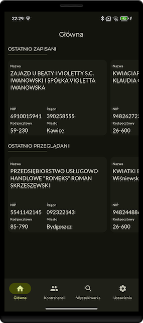
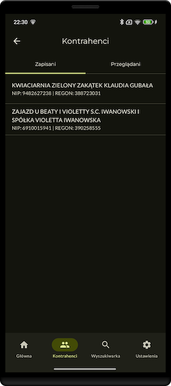
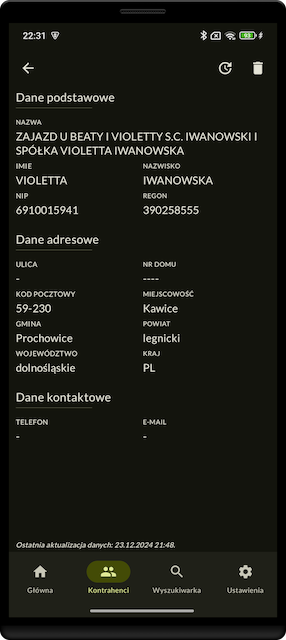
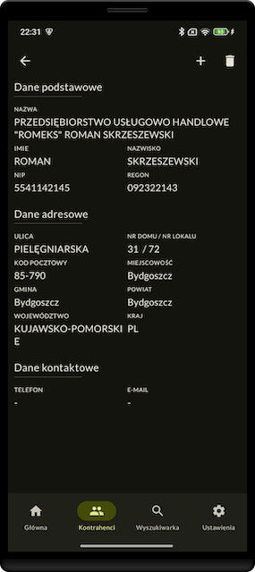
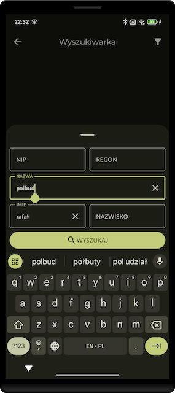
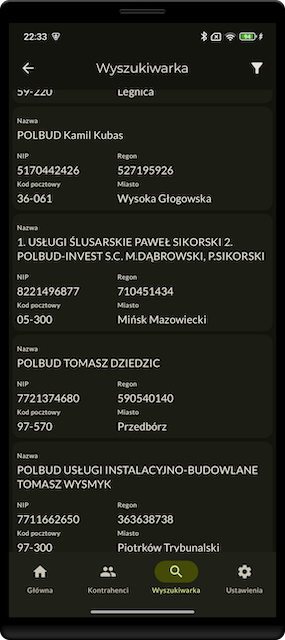
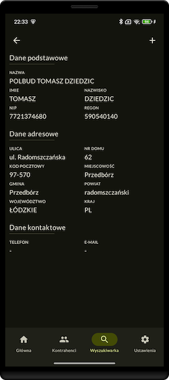
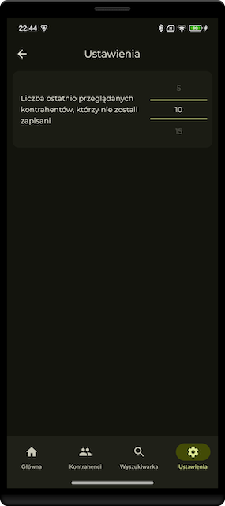

Firmly App
==================

This is the repository for my first app for Android system. It is a side project created for the purpose of learning. Firmly is entirely built with Kotlin and Jetpack Compose. I tried to apply best practices and draw from examples such as **[Jetpack Compose Samples](https://github.com/android/compose-samples)** or **[some projects form Philipp Lackner repository](https://github.com/philipplackner?tab=repositories).**

The project is not finished yet, there are many places that can be improved, but I have delivered the MVP version and I am starting with something new, that will allow me to learn more things from the world of Android.

# Features
Firmly is integrated with the **[CEIDG WEB API](https://dane.biznes.gov.pl/pl/portal/034872)** and allows the user to search, store and manage information about contractors. The app also stores recently visited but not saved contractors, and user can configure in settings how many recently visited contractors should be saved.

## Screenshots

